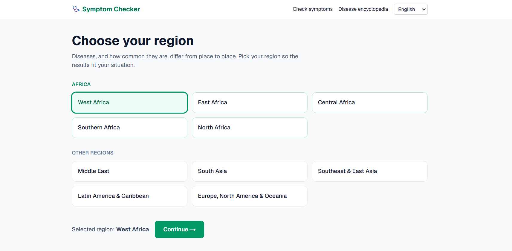
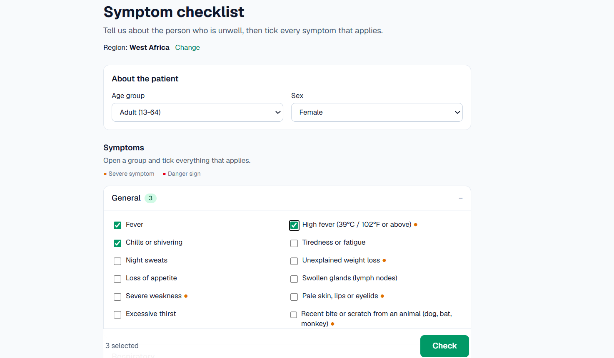
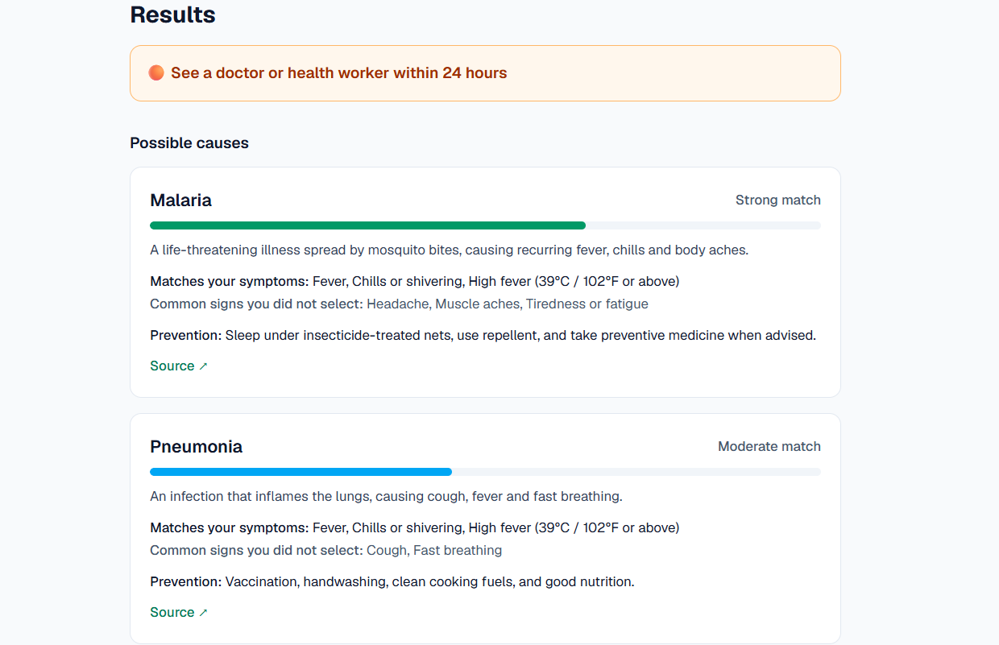
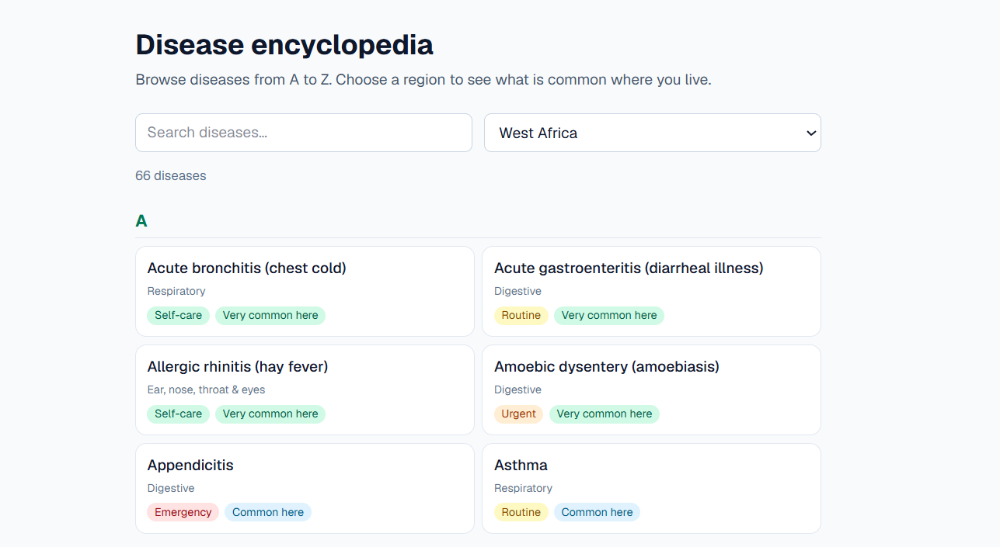
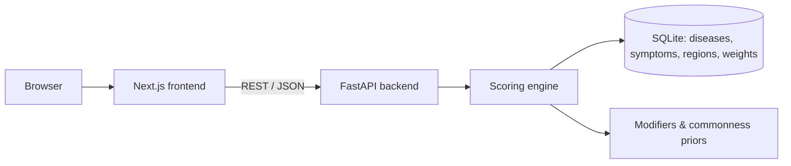

# 🩺 Symptom Checker & Disease Encyclopedia

An educational web app that helps people understand common illnesses and decide how urgently to seek care. It is **built first for Africa and other developing regions**, where reliable health information is hardest to find, and it is available in **English and French**.

> ⚠️ **Not medical advice.** This project is for education and portfolio purposes. It does not diagnose, and it must not replace a doctor or health worker.

**Live demo:** _coming soon_



## Features

- **Region-aware results.** Pick your region first. The same symptoms rank differently in West Africa than in Europe, because disease prevalence differs.
- **Checkbox symptom checker.** 63 symptoms grouped by body system and tagged minor, severe or danger sign.
- **Safety first.** Any danger-sign symptom (chest pain, stiff neck, seizures, shortness of breath, etc.) immediately stops the analysis and shows an emergency alert. No diagnosis is attempted.
- **Urgency levels.** Every result shows 🔴 emergency, 🟠 see a doctor within 24 hours, 🟡 routine, or 🟢 self-care.
- **Explainable matches.** Each result shows which of your symptoms matched, which common signs you did not select, prevention advice and a link to an official source. Match strength is shown as strong, moderate or possible, not as a fake probability.
- **Disease encyclopedia.** 70 diseases, searchable A-Z, filterable by region, with cause, prevention, typical signs and where the disease occurs.
- **Bilingual.** A language dropdown switches the whole interface and all medical content between English and French.

| Symptom checklist | Results |
|---|---|
|  |  |



## Architecture



**Stack:** Next.js (React, TypeScript, Tailwind CSS), FastAPI (Python), SQLite, pytest.

## How the scoring engine works

1. **Red flags first.** If any selected symptom is a danger sign, the engine stops and returns an emergency alert.
2. **Symptom match.** For every disease it combines how much of the selected symptoms the disease explains with how much of the disease's typical picture is present, using per-symptom weights from 0 to 1.
3. **Evidence guard.** A single symptom is weak evidence, so one lone symptom always yields a "possible" match at most.
4. **Region.** Scores are multiplied by how common the disease is in the selected region (very common, common, rare, or absent).
5. **Age, sex and commonness.** Small adjustments for diseases that affect children, older adults or one sex more, and for diseases that are much more or less common than their symptom profile suggests.
6. **Urgency.** The overall level follows the most urgent likely match. Any severe symptom raises it to at least "see a doctor within 24 hours".

The engine is deterministic and auditable. There is no black-box model.

## Data

- 70 diseases, 63 symptoms, 10 regions (five African regions, plus Middle East, South Asia, Southeast & East Asia, Latin America, and Europe/North America/Oceania), all with English and French text.
- Disease coverage is weighted towards illnesses with a high burden in Africa and other developing regions, plus common conditions found everywhere.
- Every disease links to a public-health source (WHO, CDC or MedlinePlus). The app never gives drug names or doses.
- Symptom weights, prevalence levels and commonness values are **my own estimates, informed by public sources**. They are not clinically validated.

## Validation

`python backend/validate.py` runs the engine against 40 clinical test cases (35 diseases, 5 danger-sign cases).

| Metric | Result |
|---|---|
| Danger-sign cases caught as emergency | 5 / 5 |
| Correct disease ranked first (first run) | 33 / 35 (94%) |
| Correct disease in top 3 (first run) | 35 / 35 (100%) |
| After adjusting commonness values for UTI, STI and COVID-19 | 35 / 35 ranked first |

**Honest caveat:** the test cases were written by the same person who set the weights, and the two cases that failed on the first run were then used to tune the model. These figures show internal consistency, not real-world accuracy. Independent clinician review is the most important next step.

The pytest suite (55 tests) also checks data integrity, region effects, the red-flag rule and French output.

## Run it locally

```bash
# 1. Backend
pip install -r backend/requirements.txt
python backend/build_db.py          # builds data/health.db
cd backend
python -m uvicorn main:app --reload # http://127.0.0.1:8000/docs

# 2. Frontend (new terminal)
cd frontend
npm install
npm run dev                         # http://localhost:3000

# 3. Tests and accuracy report
pip install pytest
python -m pytest backend/tests -q
python backend/validate.py
```

## Project structure

```
data/        schema, seed JSON (diseases, symptoms, regions), modifiers, test vignettes
backend/     FastAPI app, scoring engine, database builder, tests, link checker
frontend/    Next.js app (region picker, checklist, results, encyclopedia)
docs/        screenshots
```

## Limitations and ethics

- **Not a diagnostic tool.** Many illnesses look alike, and some serious ones can have mild or no symptoms.
- **Small scope.** 70 diseases cannot cover everything. A person can have something this app does not know about.
- **No travel history yet.** Someone who has just returned from another region is scored by the region they select.
- **Medical content is unreviewed.** Descriptions and weights were drafted with AI assistance and public sources and have not been reviewed by a clinician. French text has not been reviewed by a native medical translator.
- **Privacy.** The app stores nothing on a server. Language and region are saved only in your own browser.

## Roadmap

- Clinician review of data and an independent test set
- Optional recent-travel input
- More languages (Swahili, Arabic, Portuguese, Hausa)
- Offline mode (PWA) for low-connectivity areas
- Admin panel for editing diseases and sources

## Author

Built by Alusine Bah.